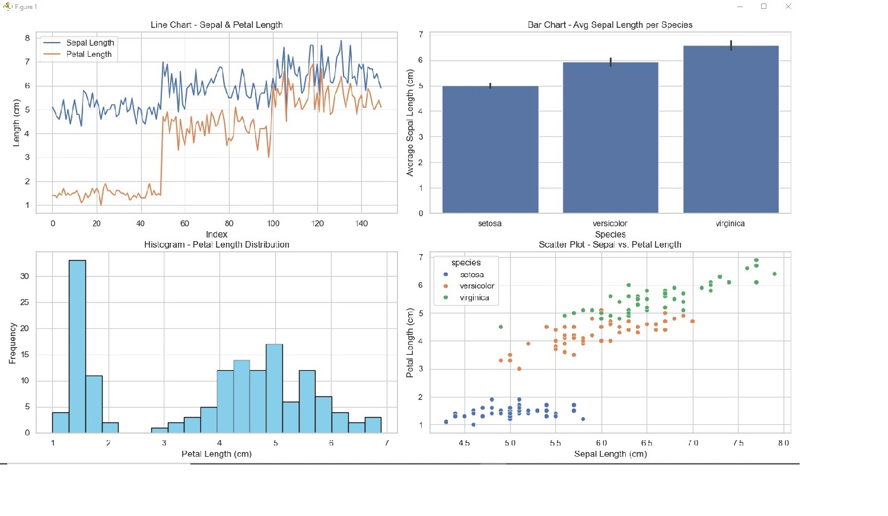

# Data Analysis with Pandas & Matplotlib

## Description
This project analyzes the Iris dataset using Pandas and visualizes it with Matplotlib and Seaborn.

## Requirements
- Python 3.x
- Pandas
- Matplotlib
- Seaborn
- Scikit-learn


## Screenshots
- **Console Output:** 
- **Generated Plots:** 
 


## How to Run
1. Open VS Code.
2. Run the following command:
   ```bash
   python analysis.py

Output
Basic statistics of the dataset.
Four types of visualizations:
Line Chart
Bar Chart
Histogram
Scatter Plot
